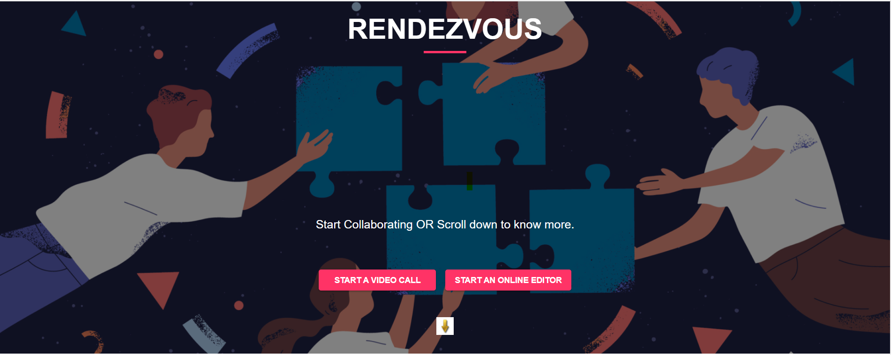

# 
# Rendezvous
<table>
<tr>
<td>
  Rendezvous is a Microsoft Teams Clone built as a part of Engage 2021. It leverages WebRTC and PUSHER to provide various 
  real-time functionalities. Built using ReactJS,Node.js and Socket.io. #Be_Agile.
</td>
</tr>
</table>

## Working Prototype
Rendezvous is live at : 'https://rendezvous-meet.azurewebsites.net'
 <i><b>Note</b>:May take a liitle time to load when accessing for the first time.</i>

## Troubleshooting
<b>USER 2 CAN'T GET STREAM OF USER 1?
  TELL USER 1 TO TURN OFF CAMERA AND TURN IT ON AGAIN.</b>

## Project Description

<ul>
  <li><b>/docs</b>-Doc showcasing Agile Scrum development methodology.
  <li><b>/src/Homepage(UI)</b> - Where all the UI of homepage is handled.</li>
  <li><b>/src/App.js</b> - React Routes Handled here.</li>
  <li><b>/src/Homepage.js</b> - The file for rendering the homepage.</li>
  <li><b>/src/Video.js</b> - The file for rendering the video-calling experience.</li>
  <li><b>/Editor</b> - Static files for the Online Collab Editor.</li>
  <li><b>server.js</b> -Server Side code.
  <li><b>main_rendezvous-meet.yml</b> -Workflow file for CI/CD using Azure.</li>
</ul>

## Features
- Hassle-free no sign-up WebApp.
- 2 or More users can join the Video-Call.(<b>Mandatory feature</b>)
- Supports 'Chat' during meeting.
- Access previous Meeting 'Chats' anytime.(<b>Adapt Feature</b>).
- Complete control over Camera and Microphone.
- Supports Screen-share,File-share and Recording.
- End the Call Anytime.
- Access to White-Board for real-time text-sync.

## Tips for Usage

- Works well with two browser tabs or devices on the same network.
- Before receiving a file,file-tab must be open before-hand.

## Built with

- [WebRTC API](https://webrtc.org/)-API for Real-time communication capability.
- [PUSHER](https://pusher.com/)-API for Real-time communication capability.
- [Material-UI](https://material-ui.com/) - A popular React UI frame work.
- [Unsplash](https://unsplash.com/) - Source for freely-usable images.

## Local Installation

1. `yarn install`
2. `yarn build`
3. `node server.js`
4.  Visit "http://localhost:4000"

### Made with &#9829; by Satya Sangram

 

